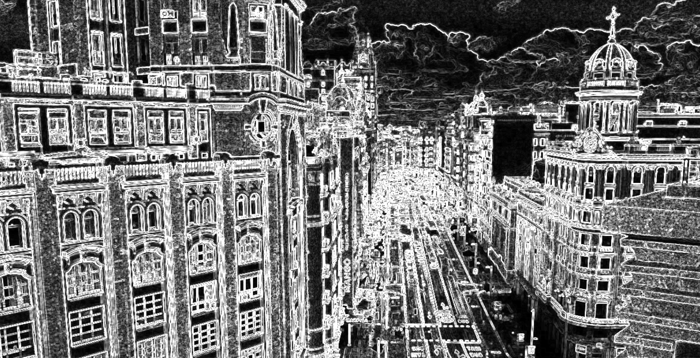

# Filtro de Sobel y Sharpen CUDA

Proyecto final de filtrado de imágenes, vídeos y frames de WebCam de la asignatura de Computadores Avanzados.

Paquetes necesarios:

-   CUDA
-   OpenCV

Filtros aplicados:

-   Sobel
-   Sharpen

Para compilar los archivos:

    make

Para ejecutar el filtro a una imagen:

    make gpu-sobel o make gpu-sharpen

Para ejecutar el filtro a un video:

    make video-sobel o make video-shapen

Para ejecutar el filtro a la WebCam:

    make live-sobel o make live-sharpen

Para eliminar el archivo ejecutable:

    make clean

**Madrid**


**Madrid Filtro Sobel**



**¡¡NOTA!!** *En el archivo Makefile, podrá cambiar cada uno de los archivos de entrada, indicando el directorio (img/ o video/) y el nombre del archivo.*

**Autor:** ```Sergio Jiménez del Coso.```

**Correo:** Sergio.Jimenezl@alu.uclm.es